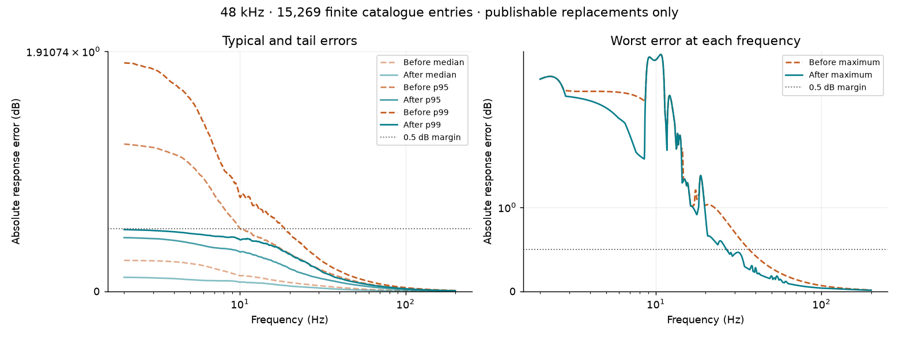
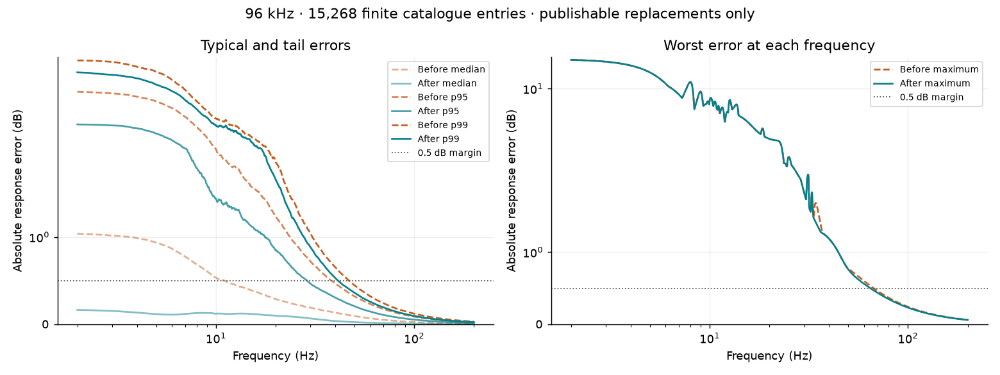
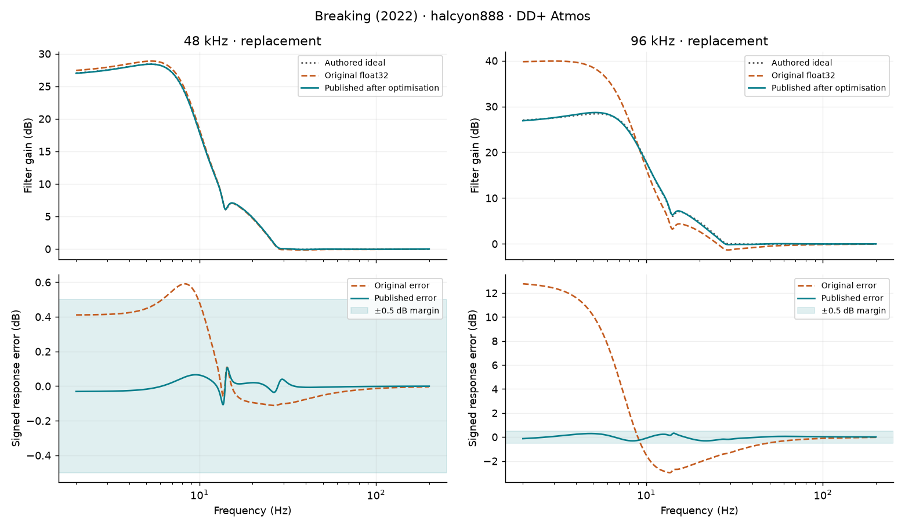
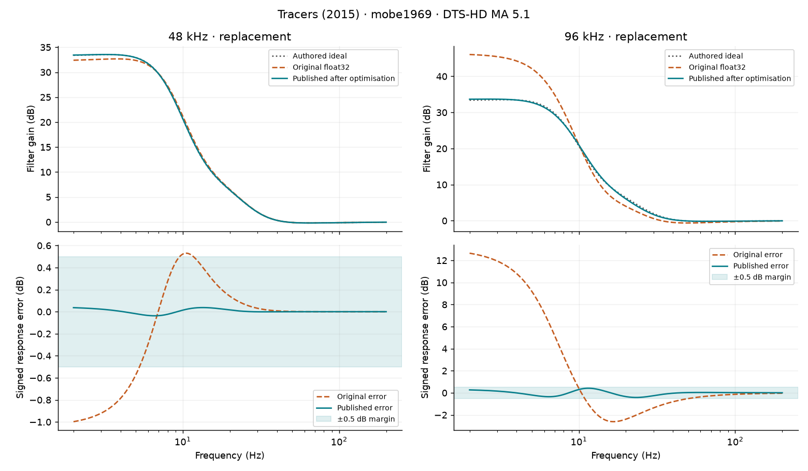

# Published BEQ coefficient optimisation

This report compares the authored RBJ response with the response predicted after float32 coefficient loading. It uses only the published filters; it does not measure film audio or validate hardware.

The complete pinned [BEQCatalogue](https://github.com/3ll3d00d/beqcatalogue) snapshot contains **15,323 entries** and **10,511 distinct title identities**. **11,871 entries (8,596 title identities) gained a publishable replacement at one or both rates.** Each entry is evaluated separately at 48 and 96 kHz, so replacements across rates must not be counted as unique titles.

A title identity is title + year + content type + season + episode. Editions, languages, audio formats and authors can have separate catalogue entries. All statistics weight each catalogue entry once per rate.

| Rate | Already within 0.5 dB | Published replacements | No replacement | Unresolved | Unsupported |
| --- | ---: | ---: | ---: | ---: | ---: |
| 48 kHz | 10,584 | 4,573 | 114 | 0 | 52 |
| 96 kHz | 2,499 | 10,400 | 2,372 | 0 | 52 |

## Whole-catalogue error by frequency

“After” uses an optimised cascade only when it passes the 0.5 dB maximum-error margin across 2–200 Hz, stability, numerical convergence and the 0.5 dB out-of-band guard. Otherwise it retains the original. Unsuccessful candidate improvements are never included as replacements.

The charts show pointwise absolute-error median, 95th and 99th percentiles, and maximum. The table reports those statistics of each entry’s maximum sampled error within each frequency band. These are different summaries: a pointwise percentile need not follow one particular entry. Chart axes use a logarithmic frequency scale and a symmetric logarithmic error scale to retain the tails.

### 48 kHz



Curves include 15,269 finite, stable original cascades; 2 unstable/nonfinite originals and 52 unsupported entries are excluded from numerical percentiles and retained in the outcome counts above.

| Band (Hz) | Median before → after (dB) | 95th percentile before → after (dB) | Maximum before → after (dB) |
| --- | ---: | ---: | ---: |
| 2–5 | 0.253 → 0.117 | 1.173 → 0.430 | 4.060 → 4.060 |
| 5–10 | 0.263 → 0.135 | 1.050 → 0.409 | 5.451 → 5.451 |
| 10–20 | 0.198 → 0.122 | 0.646 → 0.372 | 5.665 → 5.665 |
| 20–40 | 0.098 → 0.066 | 0.333 → 0.220 | 1.031 → 0.855 |
| 40–80 | 0.033 → 0.020 | 0.117 → 0.075 | 0.421 → 0.281 |
| 80–200 | 0.010 → 0.006 | 0.034 → 0.023 | 0.109 → 0.058 |

### 96 kHz



Curves include 15,268 finite, stable original cascades; 3 unstable/nonfinite originals and 52 unsupported entries are excluded from numerical percentiles and retained in the outcome counts above.

| Band (Hz) | Median before → after (dB) | 95th percentile before → after (dB) | Maximum before → after (dB) |
| --- | ---: | ---: | ---: |
| 2–5 | 1.056 → 0.176 | 4.657 → 2.917 | 16.632 → 16.632 |
| 5–10 | 1.074 → 0.203 | 4.188 → 2.897 | 13.281 → 13.281 |
| 10–20 | 0.795 → 0.224 | 2.574 → 2.170 | 8.521 → 8.521 |
| 20–40 | 0.398 → 0.166 | 1.327 → 1.026 | 4.106 → 4.106 |
| 40–80 | 0.138 → 0.045 | 0.468 → 0.314 | 1.179 → 1.179 |
| 80–200 | 0.040 → 0.012 | 0.135 → 0.082 | 0.365 → 0.346 |

## Two badly performing entries

These are the two distinct title identities with the largest original maximum error among entries that received a publishable replacement at either rate. They illustrate successful repairs; the whole-catalogue results above also include every unsuccessful search.

### Breaking (2022)

[Catalogue entry](https://beqcatalogue.readthedocs.io/en/latest/halcyon888/breaking/#dd-atmos) · filter author: halcyon888



| Rate | Original maximum error | Published maximum error | Outcome |
| --- | ---: | ---: | --- |
| 48 kHz | 0.591 dB | 0.107 dB | replacement |
| 96 kHz | 12.766 dB | 0.318 dB | replacement |

### Tracers (2015)

[Catalogue entry](https://beqcatalogue.readthedocs.io/en/latest/mobe1969/tracers/#dts-hd-ma-51) · filter author: mobe1969



| Rate | Original maximum error | Published maximum error | Outcome |
| --- | ---: | ---: | --- |
| 48 kHz | 0.997 dB | 0.037 dB | replacement |
| 96 kHz | 12.653 dB | 0.418 dB | replacement |

## Reproducing this report

Snapshot SHA-256: `e63ff69e4bf82f74d10fc503979f70c4e2a525f97512ff0dfcb91f875becc9e8`. Optimiser/report source digest: `494984a0defcdf531e8e9e5292dff45732833692dc8d4f47e08d264d03a926b5`. Settings and dependency versions are recorded in [statistics.json](statistics.json); all entry/rate outcomes are in [entry-results.json.gz](entry-results.json.gz). Source catalogue filters remain attributed to their original authors.

```bash
uv sync --extra optimiser --extra designer
uv run python -m tools.optimiser_catalogue_report /path/to/beqcatalogue/docs/database.json \
  --cache-dir /tmp/beq-catalogue-report-cache --out docs/optimiser-report --workers 12
```

The cache deduplicates identical filter/load requests and resumes interrupted work. The entire catalogue is still counted. The static PNGs and summaries are checked into this repository; viewing them needs no running service.

The ideal is the authored double-precision RBJ magnitude response. Baselines use complete published coefficients at the selected rate when present, otherwise regenerated RBJ coefficients, then float32 transport/storage. Both rates are simulated independently. Optimisation uses the default six passes and 512-point search grid; eligibility uses independently refined 8,192/16,384-point grids with 0.000001 dB convergence tolerance. Aggregates and charts use 1,024 logarithmically spaced frequencies from 2 to 200 Hz, so band tables are sampled estimates rather than the refined eligibility maxima.

This predicts coefficient-rounding error, not the device’s internal multiply/accumulate error. It preserves the authored target, section count and volume offset. A replacement meeting the margin does not establish that the authored BEQ itself is appropriate for the film.

[Library and CLI usage](../optimiser.md)
